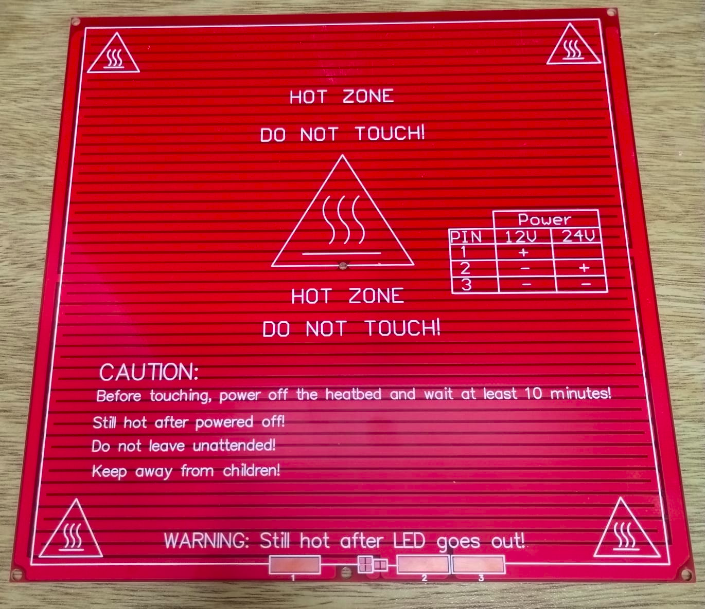

# 3D Filament Dryer
Heats and dries wet filaments to improve print quality and longevity.
 
The purpose of this project is to build a dehumidifier with Arduino modules such as humidity and temperature sensors, mosfets and rep rap printer heatbeds.

Due to limitations in the RAM memory of the Arduino Nano, the Raspberry Pi Pico was chosen, which also increases the flash to 2 MBytes.

Assembly Video
--------------
As the equipment has many parts, an assembly manual in this instance of the project becomes slow to produce, so we decided from Fusion 360 to generate a video where, in addition to seeing the dehumidifier explode, the assembly steps, screws and magnets are shown.

> All the magnets are placed under pressure (the holes have almost no play) and they must also be glued with cyanoacrylate so that the temperature does not loosen them.

> The cap handle and optical sensor bracket screws are parkers, the rest are M2x5 or M3x10/12.

https://user-images.githubusercontent.com/55675185/213236978-26854887-6648-46aa-a964-80c38ac183d2.mp4

Temperature control
-------------------
The temperature control module is based on the [QuickPID](https://github.com/Dlloydev/QuickPID) library which has an advanced anti-windup mode which prevents deep saturation and reduces overshoot.

The task of calculating the PID constants is based on the same author's [sTune](https://github.com/Dlloydev/sTune) library which uses an open-loop PID auto-tuner using a novel s-curve kneepoint test method.

Main Sensor
-----------
The main sensor of the equipment that is used to obtain the humidity and temperature of the box, is the [SHT21](https://sensirion.com/products/catalog/SHT21/) from Sensirion that can be obtained as a mounted module, for example, from [Adafruit](https://www.adafruit.com/product/1899). 

The [HTU21D](https://github.com/devxplained/HTU21D-Sensor-Library) library is used to obtain temperature compensated humidity through one of the I2C ports.

Protection Sensor
-----------------
As the box is printed in Petg, the heater should not exceed 80 degrees, that's why a [100 KHOM at 25ºC and a B of 3950K ±1% thermistor](https://a.aliexpress.com/_m0eyg30) is installed in each heated bed, and to read the temperature the [thermistor](https://github.com/miguel5612/ThermistorLibrary) library is used, which is a port of the firmware reprap.

Since there is no Arduino module for the thermistors, the divider resistor and filter capacitor are installed on the berry pico board as shown in the picture.

> Note: For now the thermistor library does not include the pull request that adds compatibility with arduinopico, so use this [link](https://github.com/jjsch-dev/ThermistorLibrary) to download the modified one.

User Interfase
--------------
The user interface is based on a 0.96-inch OLED screen that displays text and uses the [Adafruit_SSD1306](https://github.com/adafruit/Adafruit_SSD1306) library through an I2C interface.

For user input, we use a rotary encoder and the [EncoderButton](https://github.com/Stutchbury/EncoderButton) library, which depends on the [Encoder Library](https://www.pjrc.com/teensy/td_libs_Encoder.html) and the [EncoderLibrary Bounce2](https://github.com/thomasfredericks/Bounce2) libraries.

> Note: For now the Encoder library does not include the pull request that adds compatibility with arduinopico, so use this [link](https://github.com/jjsch-dev/Encoder) to download the modified one.

Heater
------
To heat the box, two 3D printer beds are used as heating elements.

And two [15A mofsets](https://a.aliexpress.com/_mNwI6G6) that regulate the power with PWM channels.

To homogenize the environment of the box, a [4010 fan cooler](https://a.aliexpress.com/_ms9WyQe) is used that for now turns on at 100%.

Moisture Ventilation
--------------------
So that the moisture from the filament that evaporates when heating the box goes outside, a ventilation valve is incorporated that is activated by an [Servo SG92](https://www.adafruit.com/product/169).

To control it, the internal [Servo](https://github.com/earlephilhower/arduino-pico/tree/master/libraries/Servo) library of the arduinopico porting is used, which is based on the PIO of the Rasperry Pi Pico RP2040.

- The valve is made up of three parts: a rectangular hole in the box cover with a 45-degree chamfer to increase the contact surface, the valve that has a 0.2 mm offset, and a post that, in addition to being the stop, supports the magnet that brings the door to the closed position. To fasten it, two M2 * 5 screws are used.

- When the servo arm moves down and stops pushing on the valve, the magnets attract each other and create a force of approximately 300 grams to close the vent.

- To open the valve, the servo moves the arm approximately 45 degrees, it should be noted that the servo makes the most effort at the beginning, and the plastic gear version can make a torque of 1.5 kg per centimeter.

- The servo arm is a combined part between 3D printing and injection that is sold with the kit. This is because in addition to the fact that the shaft rack is difficult to print, heat easily warps common printed plastics.

Install the arm on the servo
----------------------------

- Once the electronics of the equipment have been assembled and the firmware downloaded, connect it to the USB and select turn off the equipment in the menu so that the servo turns to the closed position.

- Insert the lever that comes with the servo kit more or less at 95° with respect to the vertical of the drawer as shown in the figure. 

- Insert the PETG printed lever and use the long screw that comes with the kit to attach the parts to the servo shaft.

- Go to the menu and turn on the equipment.

- The arm should go up as the image shows.

- To adjust the positions use the menu (close/open) to modify the opening and closing angles, pay special attention that in the **open** position the valve has play and does not touch the magnet post, and in the **close** position it does not touch the valve so the servo doesn't jam hard and get hot. 

Odometer
--------
One of the axes where the filament spool rests has a 6-position encoder so that an optical [Sensor TCRT5000 Infrared Reflection](https://www.aliexpress.com/i/1005004306354385.html) detects its movement.

One of the functions is to turn on the equipment when it detects that the reel has started to rotate and also to turn off the equipment when it no longer rotates in a certain time.

It also counts the number of turns that the spool has given since the last reset, transforming the pulses into turns by setting the diameter of the spool.

Spool rollers
-------------
The rollers where the spool rests are made up of two parts: a threaded bar M8 * 95mm that gives resistance to deformation by temperature and an ABS cover that positions them. In order for the spool to rotate as smoothly as possible, the axis is supported by two 608 ZZ bearings.

The two ABS covers are different: the used for the optical encoder has three parts, two of a light color (silver or white) and one in black so that the contrast is as high as possible. The second cover is formed by two equal pieces and the color is indistinct.

>The ABS covers are threaded so that they are taut when adjusted.

Odometer sensitivity adjustment
-------------------------------
In order for the TTL output (D0) of the odometer sensor to change when the roller is moved (from white to black and vice versa), the comparator sensitivity must be adjusted with the potentiometer.

- Use an allen key to unscrew the cap on the back of the box and insert a screwdriver until it contacts the potentiometer.

- Turn the potentiometer until the sensor status indicator turns off.

- Rotate the roller by hand until it turns back on, repeat this operation until you are sure the sensor detects transitions from white to black.

Go to the setup menu to verify that the turns counter (t) increases as the reel rotates.

Menu
----
The configuration menu maintains a simplified operation from the time when the Arduino Nano was used, which has little RAM and FLASH memory, this is not the case with the Berry.

When the device is in information mode, it displays three lines of data. 

- The first on the left shows the current temperature of the box and on the right the set one (0 = device off).
- The second line shows the remaining operating time.
- The third is the relative humidity of the box.

To enter the configuration menu you have to press the encoder.

Using the rotary encoder you can explore all the menu items, and when you need to modify a value, you have to press the encoder button, if it is editable the item is marked by inverting the colors.

Use the rotary encoder to modify the value of the element, which can be numeric or a list of options. When the rotary encoder button is pressed, in addition to saving the value in the eeprom memory, editing ends.

## Menu List
- **Exit** press the button to exit the menu.
- **Turn** turns the temperature control on/off. 
- **Temp** select the temperature of the box, the range is from 40 to 60 ° Celcius. 0 = disabled.
- **Time** select temperature control run time in hours, range is from 1 to 72 hours. 0 = disabled.
- **Tune** On to allow the device to calculate the PID constants and save them to the eeprom. It is advisable to do it without a spool and starting from room temperature.
- **Therm**  select the number of thermistors that sense the temperature of the heater to prevent it from melting the bed supports (80°Celsius). At least one is recommended.
- **Heat** displays the temperature of the heating element. Use the thermistor that is hotter.
- **Odom** activates the functions of turning on (Start) the heating element when the reel rotates, or turning off (Stop) when it has stopped for a while. (Both) activates both functions.
  - **off** time in minutes that it waits to turn off the heater when the spool stops spinning. 
  - **dia** diameter in millimeters of the spool to convert pulses to turns.
  - **t** number of turns that the reel has given since the last reset of the counter. Move the encoder to the left to reset it.
- **Open** position in degrees of the servo when the vent door is open. Typically 90 degrees.
- **Close** position in degrees of the servo when the vent door is closed. Typically 43 degrees.
- **Kp** proportional constant of the PID controller.
- **Ki** integrative constant of the PID controller.
- **Kd** derivative constant of the PID controller.
- **Frst** On to restore all parameters to factory.
- **V** firmware version. 

Schematic
---------

Assembly of electronics version one

Assembly of electronics version two

Power Supply
------------
The main power supply is 12V 20A, which is responsible for powering the heaters, the fan, and through a swicthing step-down supplying the 5V to the Berry Pico, which in turn uses the internal 3.3V regulator to power the CPU and the rest of the electronics.

The 5V step-down is connected to the berry pico with a shotcky diode so that the board can be simultaneously connected to a PC's USB, for example, to get system response via a serial port.

> Before installing the 5V supply, set the output voltage to 5.5V to compensate for diode drop.

The thermistors are connected to the ADC_REF so that the end of the positive resistive divider matches the reference of the analog-to-digital converter.

To connect the power supply to the equipment, it is recommended to use a 1.5 mm (16AWG) section cable to avoid falls, in this case we use a 70-thread [speaker cable](https://stingerelectronics.com/products/16ga-speaker-wire-white-500-roll). The length should not exceed 2 meters.

If the output voltage can be adjusted, regulate it to 12.5V to compensate for the losses in the connection cable and in the power switch.

Power Switch and Connector
--------------------------
In order for the wiring to support the power consumed by the equipment, a [KCD4 ROCKER SWITCH ON OFF DPST 4 PIN](https://a.aliexpress.com/_mMvt3Wa) and a [4-pin GX Aviation Connector](https://renhotecpro.com/product/gx16-butt-joint-straight-connector-metal-shell) were chosen, to divide into two 10A maximum circuits (one for each heater).

Download the firmware in Raspberry Pi Pico
------------------------------------------
Hold down the BOOTSEL button while plugging the board into USB. The uf2 file [filament_dryer_rp2040.ino.uf2](https://github.com/jjsch-dev/filament_dryer_rp2040/tree/master/bin/filament_dryer_rp2040.ino.uf2) should then be copied to the USB mass storage device that appears. Once programming of the new firmware is complete the device will automatically reset and be ready for use.

System Response
---------------
The device can plot the system response over USB using the Arduino serial plotter.

The curves below show how humidity drops as time goes by and the temperature rises.

## Reference
- **SetPoint** selected temperature for the box (40 to 60° Celsius).
- **BoxTemp** box temperature.
- **BoxHumidity** relative humidity of the box.
- **PWM** power of the heaters (0 to 100%).
- **BedMax** maximum temperature that heater can reach (80° Celsius).
- **BedTemp** heaters temperature.

60 degree graph

55 degree graph

50 degree graph

45 degree graph

40 degree graph

3D Printed Parts
----------------
Most of the pieces that make up the equipment are manufactured by the FDM method of 3D printing. Because the equipment can reach 60° Celcius, the box is printed in petg that resists between 5 and 10 degrees more than PLA; and the rollers, having to support the weight of the filament spool, use ABS.

The lid that contains the vent valve and the bottle for the silica gel are printed in PLA and the fixing magnets are glued with cyanoacrylate to resist deformation due to the plastic's temperature.

The male pneumatic connector can be rotated 180 degrees so that the outlet is horizontal or vertical.

Click on the link to have a [3D view](https://myhub.autodesk360.com/ue2d9d88e/g/shares/SH35dfcQT936092f0e437288384b4c88dbbf) of the equipment model developed by Manuel Vela.

Bill of Materials
-----------------
The following is a complete list of materials including 3D printed parts, electronic components, fasteners, and miscellaneous.

<table class="waffle" cellspacing="0" cellpadding="0"><thead><tr><th class="row-header freezebar-origin-ltr"></th><th id="0C0" style="width:30px;" class="column-headers-background">A</th><th id="0C1" style="width:220px;" class="column-headers-background">B</th><th id="0C2" style="width:43px;" class="column-headers-background">C</th><th id="0C3" style="width:51px;" class="column-headers-background">D</th><th id="0C4" style="width:270px;" class="column-headers-background">E</th></tr></thead><tbody><tr style="height: 20px"><th id="0R0" style="height: 20px;" class="row-headers-background">
1
</th><td class="s0" dir="ltr">Ítem</td><td class="s0" dir="ltr">Description</td><td class="s0" dir="ltr">U/M</td><td class="s0" dir="ltr">QTY</td><td class="s0" dir="ltr">Reference img</td></tr><tr style="height: 99px"><th id="0R1" style="height: 99px;" class="row-headers-background">
2
</th><td class="s1" dir="ltr">1</td><td class="s2" dir="ltr">Raspberry Pi Pico Rp2040</td><td class="s3" dir="ltr">PCS</td><td class="s4" dir="ltr">1</td><td class="s5">

</td></tr><tr style="height: 99px"><th id="0R2" style="height: 99px;" class="row-headers-background">
3
</th><td class="s1" dir="ltr">2</td><td class="s2" dir="ltr">Si7021 I2c humidity and temperature sensor</td><td class="s3" dir="ltr">PCS</td><td class="s4" dir="ltr">1</td><td class="s5">

</td></tr><tr style="height: 99px"><th id="0R3" style="height: 99px;" class="row-headers-background">
4
</th><td class="s1" dir="ltr">3</td><td class="s2" dir="ltr">Oled display 0.96 blue 128x64 I2c Sh1106 Gm009605v4</td><td class="s3" dir="ltr">PCS</td><td class="s4" dir="ltr">1</td><td class="s5">

</td></tr><tr style="height: 99px"><th id="0R4" style="height: 99px;" class="row-headers-background">
5
</th><td class="s1" dir="ltr">4</td><td class="s2" dir="ltr">Power supply step-down DC-DC 1.5 A 26v 3a Mp1584 regulator</td><td class="s3" dir="ltr">PCS</td><td class="s4" dir="ltr">1</td><td class="s5">

</td></tr><tr style="height: 99px"><th id="0R5" style="height: 99px;" class="row-headers-background">
6
</th><td class="s1" dir="ltr">5</td><td class="s2" dir="ltr">Axial fan cooler 40 x 40 mm 12V</td><td class="s3" dir="ltr">PCS</td><td class="s4" dir="ltr">1</td><td class="s5">

</td></tr><tr style="height: 99px"><th id="0R6" style="height: 99px;" class="row-headers-background">
7
</th><td class="s1" dir="ltr">6</td><td class="s2" dir="ltr">Rotative encoder KY-040</td><td class="s3" dir="ltr">PCS</td><td class="s4" dir="ltr">1</td><td class="s5">

</td></tr><tr style="height: 99px"><th id="0R7" style="height: 99px;" class="row-headers-background">
8
</th><td class="s1" dir="ltr">7</td><td class="s2" dir="ltr">NTC 100K B3950 Thermistors</td><td class="s3" dir="ltr">PCS</td><td class="s4" dir="ltr">2</td><td class="s5">

</td></tr><tr style="height: 99px"><th id="0R8" style="height: 99px;" class="row-headers-background">
9
</th><td class="s1" dir="ltr">8</td><td class="s2" dir="ltr">Heat bed Mk2b 12v/24v for 3d printer</td><td class="s3" dir="ltr">PCS</td><td class="s4" dir="ltr">2</td><td class="s5">

</td></tr><tr style="height: 99px"><th id="0R9" style="height: 99px;" class="row-headers-background">
10
</th><td class="s1" dir="ltr">9</td><td class="s2" dir="ltr">Quick connect term female FDD1.25-250 0.250&quot; (6.35mm) 16-22 AWG with cap</td><td class="s3" dir="ltr">PCS</td><td class="s4" dir="ltr">4</td><td class="s5">

</td></tr><tr style="height: 99px"><th id="0R10" style="height: 99px;" class="row-headers-background">
11
</th><td class="s1" dir="ltr">10</td><td class="s2" dir="ltr">PWM Mosfet Modul 5-36v 15a 400W</td><td class="s3" dir="ltr">PCS</td><td class="s4" dir="ltr">3</td><td class="s5">

</td></tr><tr style="height: 99px"><th id="0R11" style="height: 99px;" class="row-headers-background">
12
</th><td class="s1" dir="ltr">11</td><td class="s2" dir="ltr">Infrared sensor Tcrt5000</td><td class="s3" dir="ltr">PCS</td><td class="s4" dir="ltr">1</td><td class="s5">

</td></tr><tr style="height: 99px"><th id="0R12" style="height: 99px;" class="row-headers-background">
13
</th><td class="s1" dir="ltr">12</td><td class="s2" dir="ltr">Mini Servo Tower Pro Sg90 9g</td><td class="s3" dir="ltr">PCS</td><td class="s4" dir="ltr">1</td><td class="s5">

</td></tr><tr style="height: 99px"><th id="0R13" style="height: 99px;" class="row-headers-background">
14
</th><td class="s1" dir="ltr">13</td><td class="s2" dir="ltr">KCD4 heavy duty switch 15a 250v</td><td class="s3" dir="ltr">PCS</td><td class="s4" dir="ltr">1</td><td class="s5">

</td></tr><tr style="height: 99px"><th id="0R14" style="height: 99px;" class="row-headers-background">
15
</th><td class="s1" dir="ltr">14</td><td class="s2" dir="ltr">GX16 Aviation Butt-Joint Straight Connector Metal Shell</td><td class="s3" dir="ltr">PCS</td><td class="s4" dir="ltr">1</td><td class="s5">

</td></tr><tr style="height: 99px"><th id="0R15" style="height: 99px;" class="row-headers-background">
16
</th><td class="s1" dir="ltr">15</td><td class="s2" dir="ltr">Interlock switch PP4003 with fuse</td><td class="s3" dir="ltr">PCS</td><td class="s4" dir="ltr">1</td><td class="s5">

</td></tr><tr style="height: 99px"><th id="0R16" style="height: 99px;" class="row-headers-background">
17
</th><td class="s1" dir="ltr">16</td><td class="s2" dir="ltr">Dupont 2.54 mm female metalic connector</td><td class="s3" dir="ltr">PCS</td><td class="s4" dir="ltr">8</td><td class="s5">

</td></tr><tr style="height: 99px"><th id="0R17" style="height: 99px;" class="row-headers-background">
18
</th><td class="s1" dir="ltr">17</td><td class="s2" dir="ltr">Dupont 2.54 mm female plastic connector 4 ways</td><td class="s3" dir="ltr">PCS</td><td class="s4" dir="ltr">2</td><td class="s5">

</td></tr><tr style="height: 99px"><th id="0R18" style="height: 99px;" class="row-headers-background">
19
</th><td class="s1" dir="ltr">18</td><td class="s2" dir="ltr">Flat cable 4 Conductors Awg</td><td class="s3" dir="ltr">MTS</td><td class="s4" dir="ltr">0,6</td><td class="s5">

</td></tr><tr style="height: 99px"><th id="0R19" style="height: 99px;" class="row-headers-background">
20
</th><td class="s1" dir="ltr">19</td><td class="s2" dir="ltr">16GA speaker wire</td><td class="s3" dir="ltr">MTS</td><td class="s4" dir="ltr">2</td><td class="s5">

</td></tr><tr style="height: 99px"><th id="0R20" style="height: 99px;" class="row-headers-background">
21
</th><td class="s1" dir="ltr">20</td><td class="s2" dir="ltr">Bearing 608zz</td><td class="s3" dir="ltr">PCS</td><td class="s4" dir="ltr">4</td><td class="s5">

</td></tr><tr style="height: 99px"><th id="0R21" style="height: 99px;" class="row-headers-background">
22
</th><td class="s1" dir="ltr">21</td><td class="s2" dir="ltr">Neumatic joint for hotend M10 (reference: Creality Ender 3)</td><td class="s3" dir="ltr">PCS</td><td class="s4" dir="ltr">1</td><td class="s5">

</td></tr><tr style="height: 99px"><th id="0R22" style="height: 99px;" class="row-headers-background">
23
</th><td class="s1" dir="ltr">22</td><td class="s2" dir="ltr">Neodymium magnet D5xH3 mm</td><td class="s3" dir="ltr">PCS</td><td class="s4" dir="ltr">28</td><td class="s5">

</td></tr><tr style="height: 99px"><th id="0R23" style="height: 99px;" class="row-headers-background">
24
</th><td class="s1" dir="ltr">23</td><td class="s2" dir="ltr">DIN 912 Allen screw M2 x 0,4 x 5 mm</td><td class="s3" dir="ltr">PCS</td><td class="s4" dir="ltr">16</td><td class="s5">

</td></tr><tr style="height: 99px"><th id="0R24" style="height: 99px;" class="row-headers-background">
25
</th><td class="s1" dir="ltr">24</td><td class="s2" dir="ltr">DIN 912 Allen screw M3 x 0,5 x 10 mm</td><td class="s3" dir="ltr">PCS</td><td class="s4" dir="ltr">2</td><td class="s5">

</td></tr><tr style="height: 99px"><th id="0R25" style="height: 99px;" class="row-headers-background">
26
</th><td class="s1" dir="ltr">25</td><td class="s2" dir="ltr">DIN 912 Allen screw M3 x 0,5 x 12 mm</td><td class="s3" dir="ltr">PCS</td><td class="s4" dir="ltr">5</td><td class="s5">

</td></tr><tr style="height: 99px"><th id="0R26" style="height: 99px;" class="row-headers-background">
27
</th><td class="s1" dir="ltr">26</td><td class="s2" dir="ltr">DIN 912 Allen screw M3 x 0,5 x 20 mm</td><td class="s3" dir="ltr">PCS</td><td class="s4" dir="ltr">5</td><td class="s5">

</td></tr><tr style="height: 99px"><th id="0R27" style="height: 99px;" class="row-headers-background">
28
</th><td class="s1" dir="ltr">27</td><td class="s2" dir="ltr">M3 x 0,5 mm Square nut</td><td class="s3" dir="ltr">PCS</td><td class="s4" dir="ltr">7</td><td class="s5">

</td></tr><tr style="height: 99px"><th id="0R28" style="height: 99px;" class="row-headers-background">
29
</th><td class="s1" dir="ltr">28</td><td class="s2" dir="ltr">Parker self tapping screw #4 D2,9 mm x L3/8&quot;</td><td class="s3" dir="ltr">PCS</td><td class="s4" dir="ltr">12</td><td class="s5">

</td></tr><tr style="height: 99px"><th id="0R29" style="height: 99px;" class="row-headers-background">
30
</th><td class="s1" dir="ltr">29</td><td class="s2" dir="ltr">Threaded rod M8 x 1,25 mm, lenght 95 mm</td><td class="s3" dir="ltr">PCS</td><td class="s4" dir="ltr">2</td><td class="s5">

</td></tr><tr style="height: 99px"><th id="0R30" style="height: 99px;" class="row-headers-background">
31
</th><td class="s1" dir="ltr">30</td><td class="s2" dir="ltr">dry_box_baseBottom_v1.2</td><td class="s3" dir="ltr">PCS</td><td class="s4" dir="ltr">1</td><td class="s5">

</td></tr><tr style="height: 99px"><th id="0R31" style="height: 99px;" class="row-headers-background">
32
</th><td class="s1" dir="ltr">31</td><td class="s2" dir="ltr">bearing_top_cover_v1.0</td><td class="s3" dir="ltr">PCS</td><td class="s4" dir="ltr">4</td><td class="s5">

</td></tr><tr style="height: 99px"><th id="0R32" style="height: 99px;" class="row-headers-background">
33
</th><td class="s1" dir="ltr">32</td><td class="s2" dir="ltr">optic_support_v1.0</td><td class="s3" dir="ltr">PCS</td><td class="s4" dir="ltr">1</td><td class="s5">

</td></tr><tr style="height: 99px"><th id="0R33" style="height: 99px;" class="row-headers-background">
34
</th><td class="s1" dir="ltr">33</td><td class="s2" dir="ltr">racord_base_v1.2</td><td class="s3" dir="ltr">PCS</td><td class="s4" dir="ltr">1</td><td class="s5">

</td></tr><tr style="height: 99px"><th id="0R34" style="height: 99px;" class="row-headers-background">
35
</th><td class="s1" dir="ltr">34</td><td class="s2" dir="ltr">special_screw_v1</td><td class="s3" dir="ltr">PCS</td><td class="s4" dir="ltr">1</td><td class="s5">

</td></tr><tr style="height: 99px"><th id="0R35" style="height: 99px;" class="row-headers-background">
36
</th><td class="s1" dir="ltr">35</td><td class="s2" dir="ltr">handle_base_v1.1</td><td class="s3" dir="ltr">PCS</td><td class="s4" dir="ltr">1</td><td class="s5">

</td></tr><tr style="height: 99px"><th id="0R36" style="height: 99px;" class="row-headers-background">
37
</th><td class="s1" dir="ltr">36</td><td class="s2" dir="ltr">handle_v1.1</td><td class="s3" dir="ltr">PCS</td><td class="s4" dir="ltr">1</td><td class="s5">

</td></tr><tr style="height: 99px"><th id="0R37" style="height: 99px;" class="row-headers-background">
38
</th><td class="s1" dir="ltr">37</td><td class="s2" dir="ltr">dry_box_baseTop_v1.2</td><td class="s3" dir="ltr">PCS</td><td class="s4" dir="ltr">1</td><td class="s5">

</td></tr><tr style="height: 99px"><th id="0R38" style="height: 99px;" class="row-headers-background">
39
</th><td class="s1" dir="ltr">38</td><td class="s2" dir="ltr">dry_box_top_v1.2</td><td class="s3" dir="ltr">PCS</td><td class="s4" dir="ltr">1</td><td class="s5">

</td></tr><tr style="height: 99px"><th id="0R39" style="height: 99px;" class="row-headers-background">
40
</th><td class="s1" dir="ltr">39</td><td class="s2" dir="ltr">magnet_gate_base_v1.0</td><td class="s3" dir="ltr">PCS</td><td class="s4" dir="ltr">1</td><td class="s5">

</td></tr><tr style="height: 99px"><th id="0R40" style="height: 99px;" class="row-headers-background">
41
</th><td class="s1" dir="ltr">40</td><td class="s2" dir="ltr">arm_servo</td><td class="s3" dir="ltr">PCS</td><td class="s4" dir="ltr">1</td><td class="s5">

</td></tr><tr style="height: 99px"><th id="0R41" style="height: 99px;" class="row-headers-background">
42
</th><td class="s1" dir="ltr">41</td><td class="s2" dir="ltr">dry_box_gate_v2.0</td><td class="s3" dir="ltr">PCS</td><td class="s4" dir="ltr">1</td><td class="s5">

</td></tr><tr style="height: 99px"><th id="0R42" style="height: 99px;" class="row-headers-background">
43
</th><td class="s1" dir="ltr">42</td><td class="s2" dir="ltr">electronics_case_mb_cover_v1.5</td><td class="s3" dir="ltr">PCS</td><td class="s4" dir="ltr">1</td><td class="s5">

</td></tr><tr style="height: 99px"><th id="0R43" style="height: 99px;" class="row-headers-background">
44
</th><td class="s1" dir="ltr">43</td><td class="s2" dir="ltr">electronics_case_mb_bottom_v1.2</td><td class="s3" dir="ltr">PCS</td><td class="s4" dir="ltr">1</td><td class="s5">

</td></tr><tr style="height: 99px"><th id="0R44" style="height: 99px;" class="row-headers-background">
45
</th><td class="s1" dir="ltr">44</td><td class="s2" dir="ltr">stepdown_support_v1.2</td><td class="s3" dir="ltr">PCS</td><td class="s4" dir="ltr">1</td><td class="s5">

</td></tr><tr style="height: 99px"><th id="0R45" style="height: 99px;" class="row-headers-background">
46
</th><td class="s1" dir="ltr">45</td><td class="s2" dir="ltr">LCD-knob_v2 v2</td><td class="s3" dir="ltr">PCS</td><td class="s4" dir="ltr">1</td><td class="s5">

</td></tr><tr style="height: 99px"><th id="0R46" style="height: 99px;" class="row-headers-background">
47
</th><td class="s1" dir="ltr">46</td><td class="s2" dir="ltr">axis_cover_short</td><td class="s3" dir="ltr">PCS</td><td class="s4" dir="ltr">1</td><td class="s5">

</td></tr><tr style="height: 99px"><th id="0R47" style="height: 99px;" class="row-headers-background">
48
</th><td class="s1" dir="ltr">47</td><td class="s2" dir="ltr">axis_cover_joint</td><td class="s3" dir="ltr">PCS</td><td class="s4" dir="ltr">1</td><td class="s5">

</td></tr><tr style="height: 99px"><th id="0R48" style="height: 99px;" class="row-headers-background">
49
</th><td class="s1" dir="ltr">48</td><td class="s2" dir="ltr">axis_cover_long</td><td class="s3" dir="ltr">PCS</td><td class="s4" dir="ltr">1</td><td class="s5">

</td></tr><tr style="height: 99px"><th id="0R49" style="height: 99px;" class="row-headers-background">
50
</th><td class="s1" dir="ltr">49</td><td class="s2" dir="ltr">axis_cover_nut</td><td class="s3" dir="ltr">PCS</td><td class="s4" dir="ltr">2</td><td class="s5">

</td></tr></tbody></table>

