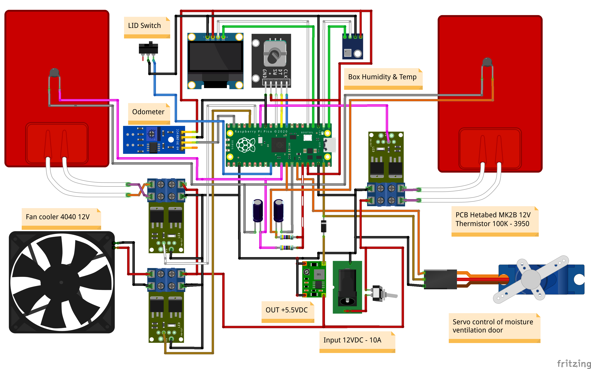

# 3D Filament Dryer
Heats and dries wet filaments to improve print quality and longevity.
 
The purpose of this project is to build a dehumidifier with Arduino modules such as humidity and temperature sensors, mosfets and rep rap printer heatbeds.

Due to limitations in the RAM memory of the Arduino Nano, the Raspberry Pi Pico was chosen, which also increases the flash to 2 MBytes.

Temperature control
-------------------
The temperature control module is based on the [QuickPID](https://github.com/Dlloydev/QuickPID) library which has an advanced anti-windup mode which prevents deep saturation and reduces overshoot.

The task of calculating the PID constants is based on the same author's [sTune](https://github.com/Dlloydev/sTune) library which uses an open-loop PID auto-tuner using a novel s-curve kneepoint test method.

Sensors
-------
The main sensor of the equipment that is used to obtain the humidity and temperature of the box, is the [SHT21](https://sensirion.com/products/catalog/SHT21/) from Sensirion that can be obtained as a mounted module, for example, from [Adafruit](https://www.adafruit.com/product/1899). 

The [HTU21D](https://github.com/devxplained/HTU21D-Sensor-Library) library is used to obtain temperature compensated humidity through one of the I2C ports.

As the box is printed in Petg, it is not convenient for the heated bed to exceed 80 degrees, two 100 KHOM thermistors are used in conjunction with the library [thermistor](https://github.com/miguel5612/ThermistorLibrary) that is a porting of the reprap firmware.

User Interfase
--------------
The user interface is based on a 0.96-inch screen for presentation and a rotary encoder for input.
To control the display via I2C the [Adafruit_SSD1306](https://github.com/adafruit/Adafruit_SSD1306) library is used, and for the rotary encoder the [EncoderButton]() library, which depends on the [Encoder library](https://www.pjrc.com/teensy/td_libs_Encoder.html) and [Bounce2 library](https://github.com/thomasfredericks/Bounce2) libraries.

The User Interface class uses these libraries to iterate a list of items that make up the configuration menu, and with callback functions (get/set/edit/end edit/exit) it communicates with the application.

Heater
------
To heat the box, two 3D printer beds are used as heating elements with two 15A mofsets that regulate the power with PWM channels.
To homogenize the environment of the box, a 40x40 mm fan cooler is used that for now turns on at 100%.

Moisture Ventilation
--------------------
So that the moisture from the filament that evaporates when heating the box goes outside, a ventilation valve is incorporated that is activated by an [Servo SG92](https://www.adafruit.com/product/169).

To control it, the internal [Servo](https://github.com/earlephilhower/arduino-pico/tree/master/libraries/Servo) library of the arduinopico porting is used, which is based on the PIO of the Rasperry Pi Pico RP2040.

Odometer
--------
One of the axes where the filament spool rests has a 6-position encoder so that an optical [Sensor TCRT5000 Infrared Reflection](https://www.aliexpress.com/i/1005004306354385.html) detects its movement.

One of the functions is to turn on the equipment when it detects that the reel has started to rotate and also to turn off the equipment when it no longer rotates in a certain time.

It also counts the number of turns that the spool has given since the last reset, transforming the pulses into turns by setting the diameter of the spool.

Schematic
---------

System Response
---------------
The device can plot the system response over USB using the Arduino serial plotter.

The curves below show how humidity drops as time goes by and the temperature rises.

## Reference
- **SetPoint** selected temperature for the box (40 to 60° Celsius).
- **BoxTemp** box temperature.
- **BoxHumidity** relative humidity of the box.
- **PWM** power of the heaters (0 to 100%).
- **BedMax** maximum temperature that heater can reach (80° Celsius).
- **BedTemp** heaters temperature.

60 degree graph

55 degree graph

50 degree graph

45 degree graph

40 degree graph

